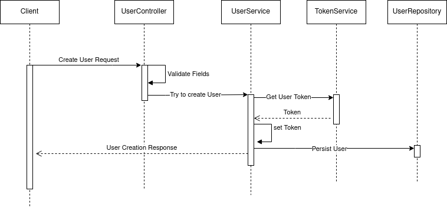

# Usuarios Sentra Prueba Técnica

API RESTful de creación de usuarios con validación de email, password, generación y persistencia de token.


## Stack

- Lenguaje de programación [Java 11](https://www.java.com/en/download/help/download_options.html)
- Gestión de dependencias [Gradle 8.5.0](https://gradle.org/)
- Framework de desarrollo [Spring Boot 2.7.0](https://spring.io/projects/spring-boot)

## Diagrama solución propuesta

A continuación, se muestra la solución propuesta del servicio principal, que es el de Creación de Usuarios.



## Correr Local

- Clonar el proyecto

```bash
  git clone https://github.com/robertoMaclean/sentra-users.git
```

- Ir al directorio

```bash
  cd sentra-users
```

- Instalar dependencias

```bash
  gradle build
```

- Arrancar el servidor

```bash
  gradle bootRun
```
- Ejemplo creación de usuario
```bash
curl --request POST \
  --url http://localhost:8080/user/ \
  --header 'Content-Type: application/json' \
  --data '{
	"name": "Juan Rodriguez",
	"email": "juan@rodriguez.org",
	"password": "hunter2",
	"phones": [
		{
			"number": "+56878987",
			"citycode": "1",
			"countrycode": "57"
		}
	]
}'
```

## Documentación

Levantar el Servidor e ir al siguiente link de [Swagger](http://localhost:8080/swagger-ui/).


## Configuración validación contraseña

La contraseña se valida mediante una expresión regular, la cual, puede ser configurada dentro de las properties del proyecto en la ruta ***src/main/resources/application.properties*** la propiedad se llama ***password.regexp***


## Autor

- [@robertoMaclean](https://www.github.com/robertoMaclean)

