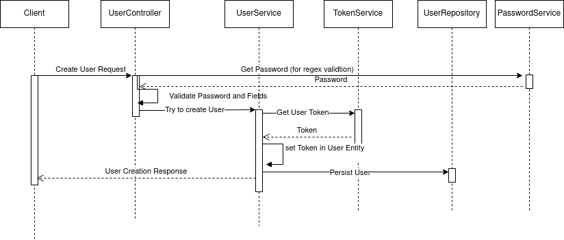

# Prueba Técnica API Usuarios

### Contenido

- [Descripción](#descripción)
- [Stack Tecnológico](#stack-tecnolgico)
- [Diagrama solución propuesta](#diagrama-solución-propuesta)
- [Correr Local](#correr-local)
- [Test](#test)
- [Base de datos](#base-de-datos)
- [Documentación](#documentación)
- [Configuración validación contraseña](#configuración-validación-contraseña)
- [Autor](#autor)
- [Links](#links)


## Descripción

Este proyecto consiste en un sistema que permite registrar usuarios, validar contraseña, 
email y generar un token utilizando JWT.


## Stack Tecnológico

A continuación se detallan las tecnologías utilizadas para el desarrollo del proyecto.

- Lenguaje de programación [Java 17](https://www.java.com/en/download/help/download_options.html)
- Gestión de dependencias [Gradle 8.5.0](https://./gradlew.org/)
- Framework de desarrollo [Spring Boot 3.2.4](https://spring.io/projects/spring-boot)
- IDE [Intellij](https://www.jetbrains.com)
- Gestión versiones JDK [SDKMAN](https://sdkman.io/)

## Diagrama solución propuesta

A continuación, se muestra la solución el diagrama de solución propuesta del servicio principal, que es el de Creación de Usuarios.



## Correr Local

- Clonar el proyecto

```bash
  git clone https://github.com/robertoMaclean/technical-test-users.git
```

- Ir al directorio

```bash
  cd technical-test-users
```

- Instalar dependencias y arrancar servidor

```bash
  ./gradlew build
  ./gradlew bootRun
```

- Ejemplo creación de usuario

```bash
curl --request POST \
  --url http://localhost:8080/user \
  --header 'Content-Type: application/json' \
  --data '{
	"name": "Juan Rodriguez",
	"email": "juan@rodriguez.org",
	"password": "hunter2",
	"phones": [
		{
			"number": "+56878987",
			"citycode": "1",
			"countrycode": "57"
		}
	]
}'
```

## Test

Para la ejecución de test debe ingresar el siguiente comando:
```bash
./gradlew test
```

## Base de datos

No es necesario crear la Base de Datos, ya que esta se genera con el ORM mediante código (Code First). La Base de Datos es una ***H2***, 
lo datos persisten en memoria y en cada reinicio del servidor los datos se borran.

## Documentación

Para ver el detalle de la definición de la API, seguir las siguientes indicaciones:

- Iniciar
```bash
./gradlew bootRun
```

- ir al siguiente link [Swagger](http://localhost:8080/api-docs).


## Configuración validación contraseña

La validación de contraseña es configurable desde un servicio habilitado para dicho propósito. A continuación un ejemplo 
de como se puede configurar la contraseña.

```bash
curl --request POST \
  --url http://localhost:8080/password \
  --header 'Content-Type: application/json' \
  --data '{
	"minLength": 3,
	"maxLength": 10,
	"requiresUpperCase": true,
	"requiresLowerCase": false,
	"requiresDigit": false,
	"requiresSpecialChar": true
}'
```

## Autor
Roberto Mac lean M.

## Links

- [Github](https://www.github.com/robertoMaclean)
- [Mi Portafolio](https://robmaclean-portfolio.netlify.app)

